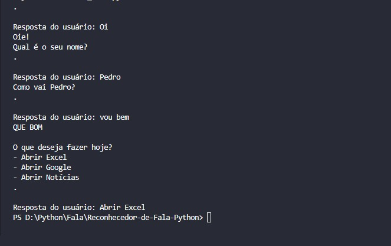
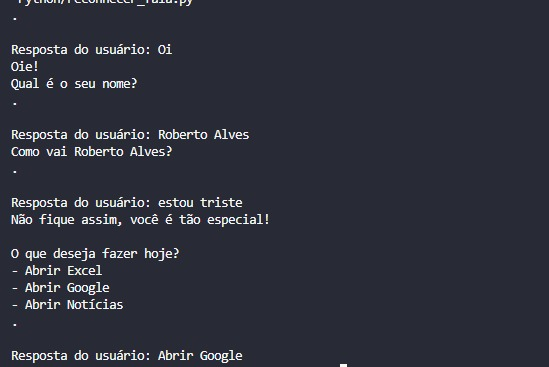

# Reconhecedor de Fala e Automatização de Tarefas
 Um programa Python que entende e responde à fala humana. Ele pode cumprimentá-lo, perguntar seu nome e fazer algumas tarefas com automação. Dependendo de como você responde, mensagens diferentes serão transmitidas. Ele pode ser usado como assistente de voz para ajudar a realizar tarefas simples, responder perguntas e até mesmo controlar coisas em sua casa usando comandos de voz. Simplificando, é um programa que interage com o computador conversando com ele.


## 📋 Índices 
- <a href="#funcionalidades"> Funcionalidades </a>
- <a href="#demonstracao"> Demonstração </a>
- <a href="#tecnologias"> Tecnologias Utilizadas </a>
- <a href="#biblioteca"> Bibliotecas Python Utilizadas </a>
- <a href="#instalando"> Instalando as bibliotecas necessárias </a>
- <a href="#utilidades"> Utilizades do Programa </a>


## 💻 Funcionalidades: <a id="funcionalidades"></a>
- ✅ Reconhecedor de Fala;
- ✅ Conversão da fala para texto (ouvir e transcrever);
- ✅ Linguagem do sistema = Português-Brasil;
- ✅ Automatização de tarefas.


## 👨🏽‍💻 Demonstração: <a id="demonstracao"></a>



Um software executado em um ambiente de terminal.

## 🛠 Tecnologias Utilizadas: <a id="tecnologias"></a>
- [Python](https://www.python.org/) - Linguagem de programação utilizada;

## 📚 Bibliotecas Python Utilizadas: <a id="biblioteca"></a>
- 📕 Speech Recognition (biblioteca de reconhecimento de fala em Python);

- 📗 PyAutoGUI (é uma ferramenta útil para automatizar tarefas repetitivas, como clicar em botões, digitar texto ou arrastar e soltar elementos).

- 📘 Time (biblioteca padrão do Python que é utilizada para lidar com operações relacionadas ao tempo)

## ⚙️ Instalando as bibliotecas necessárias: <a id="instalando"></a>
```bash
    # instalando a biblioteca de reconhecimento de fala em Python
    pip install SpeechRecognition

    # instalando a biblioteca de automatização em Python   
    pip install pyautogui
```

## 📌 Utilidades do Programa: <a id="utilidades"></a>
- ✅ O programa é capaz de ouvir o que você diz e também tem a capacidade de transcrever o que foi dito;

- ✅ O sistema pode ser usado como um Assistente Virtual Pessoal;

- ✅ Pode ser integrado a jogos ou experiências de entretenimento interativo, onde os jogadores podem se comunicar com personagens ou realizar ações no jogo por meio de comandos de voz;

- ✅ Integrado a aplicativos educacionais, o sistema pode fornecer suporte na aprendizagem de idiomas, pronúncia, entre outros, tornando o processo mais interativo;

- ✅ O sistema apresenta automatizações de tarefas, onde o sistema por si próprio realiza a tal atividade por comando de voz.


